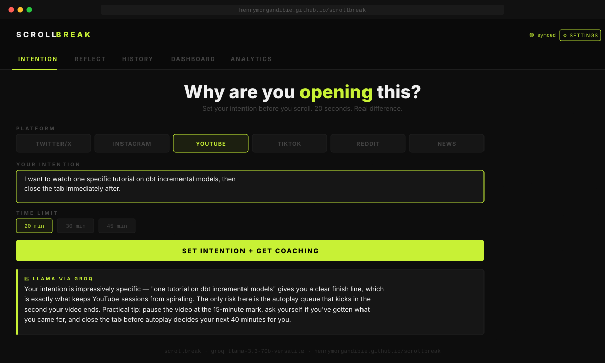

# ScrollBreak 🛑

> AI-powered doomscrolling intervention — intention setting, session timer, reflection journaling, pattern coaching, team dashboards, and clinical analytics. Powered by Groq Llama.



---

## ⚠️ Honest: What actually works

| Feature | Works? | Notes |
|---|---|---|
| Web app (intention + reflect + history) | ✅ Full | Open manually at the URL below |
| Chrome extension (tab interception) | ✅ Full | Intercepts social media on desktop Chrome |
| AI coaching via Groq Llama | ✅ Full | Requires free Groq API key |
| Family / team dashboard | ✅ Full | Data shared via same backend |
| Clinical analytics | ✅ Full | Needs a few sessions logged first |
| Multi-device sync | ✅ With backend | Self-host the Express server |
| Blocking mobile apps (TikTok, Instagram etc.) | ❌ Not possible | Extensions cannot touch native apps |
| Push notifications / reminders | ❌ Not built | Use phone Screen Time as enforcement layer |

**Bottom line:** The Chrome extension has real teeth on desktop. On mobile, this is a friction-by-choice tool — it works if you open it intentionally. Pair it with iPhone Screen Time or Android Digital Wellbeing for hard enforcement on your phone.

---

## What it does

ScrollBreak interrupts the doomscrolling habit at three points:

**Before** — State why you're opening a platform and set a time limit. Llama coaches you on whether your intention is genuine or a cover for mindless scrolling.

**During** — A session timer tracks actual vs. intended time. Flashes red when your limit expires.

**After** — Log your mood and whether you hit your goal. Llama gives a personalized debrief naming the pattern it sees.

**Over time** — Every session builds a local history. AI pattern analysis surfaces your biggest behavioral risks across platforms.

---

## Getting started

### Web app

1. Go to [henrymorgandibie.github.io/scrollbreak](https://henrymorgandibie.github.io/scrollbreak)
2. Click **⚙ SETTINGS** → paste your [Groq API key](https://console.groq.com) (free)
3. Pick a platform, write your intention, set a time limit
4. Hit **SET INTENTION + GET COACHING**

### Chrome extension (real tab interception — desktop only)

The extension intercepts Chrome tabs when you navigate to Twitter/X, YouTube, Instagram, TikTok, Reddit, or news sites — and forces an intention screen before the page loads.

**Install (local):**
1. Clone or download this repo
2. Open `chrome://extensions` in Chrome
3. Toggle **Developer mode** ON (top right)
4. Click **Load unpacked**
5. Select the `/extension` folder from this repo
6. Done — open YouTube and see it intercept

**To add your Groq key to the extension:**
- Click the ScrollBreak icon in your Chrome toolbar
- Paste your Groq key in the popup
- The extension will now show Llama coaching inside the overlay

**Platforms intercepted:** Twitter/X · Instagram · TikTok · YouTube · Reddit · Google News · BBC · CNN

### On mobile (workaround)

Since browser extensions don't work on mobile apps:

1. **Delete the native apps** from your phone (Twitter, TikTok, Instagram)
2. Access them only via Safari or Chrome mobile — the friction helps
3. Bookmark `henrymorgandibie.github.io/scrollbreak` and open it first
4. Use **iPhone Screen Time** or **Android Digital Wellbeing** for hard time limits

### Backend sync (optional)

```bash
cd backend
npm install
node server.js
```

Deploy to Railway or Render for production. Add your backend URL + user ID in Settings to sync across devices.

---

## Project structure

```
scrollbreak/
├── index.html                ← GitHub Pages entry (redirects to app/)
├── app/                      ← Web app
│   ├── index.html
│   ├── css/main.css
│   └── js/
│       ├── storage.js        ← localStorage + backend sync
│       ├── groq.js           ← Groq API client + all prompts
│       ├── app.js            ← Intention, reflect, history
│       ├── dashboard.js      ← Family/team dashboard
│       └── analytics.js      ← Clinical analytics + charts
├── extension/                ← Chrome extension
│   ├── manifest.json
│   ├── background.js         ← Tab interception service worker
│   ├── content.js            ← Intention overlay injected into pages
│   ├── content.css
│   └── popup.html
├── backend/                  ← Optional sync server
│   ├── server.js             ← Express + SQLite
│   └── package.json
└── docs/
    ├── ARCHITECTURE.md
    └── screenshot.svg
```

---

## Tech stack

| Layer | Choice |
|---|---|
| Frontend | Vanilla HTML/CSS/JS — no build step |
| AI | Groq API — `llama-3.3-70b-versatile` |
| Storage | localStorage (web) · chrome.storage (extension) |
| Backend | Node.js + Express + SQLite |
| Hosting | GitHub Pages (web) · any Node host (backend) |

---

## Privacy

- Groq API key stored only in your browser — sent only to `api.groq.com`
- Session data is local by default — backend sync is opt-in and self-hosted
- Chrome extension activates only on domains listed in `manifest.json`
- No analytics, no tracking, no accounts

---

## License

MIT

